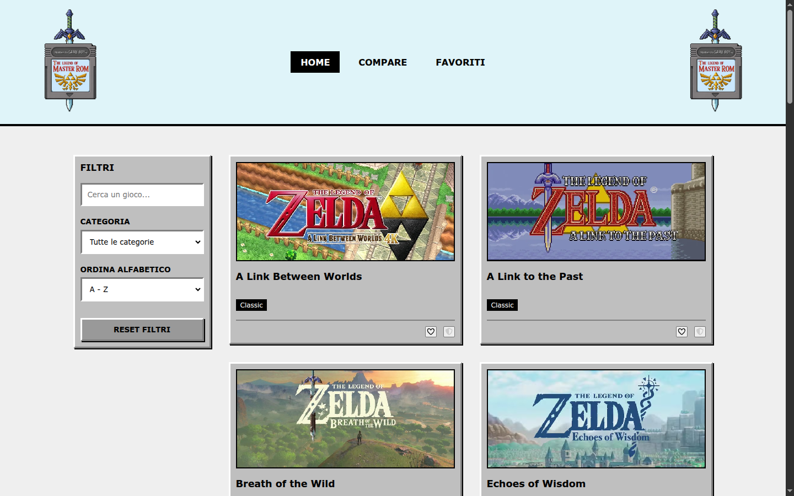
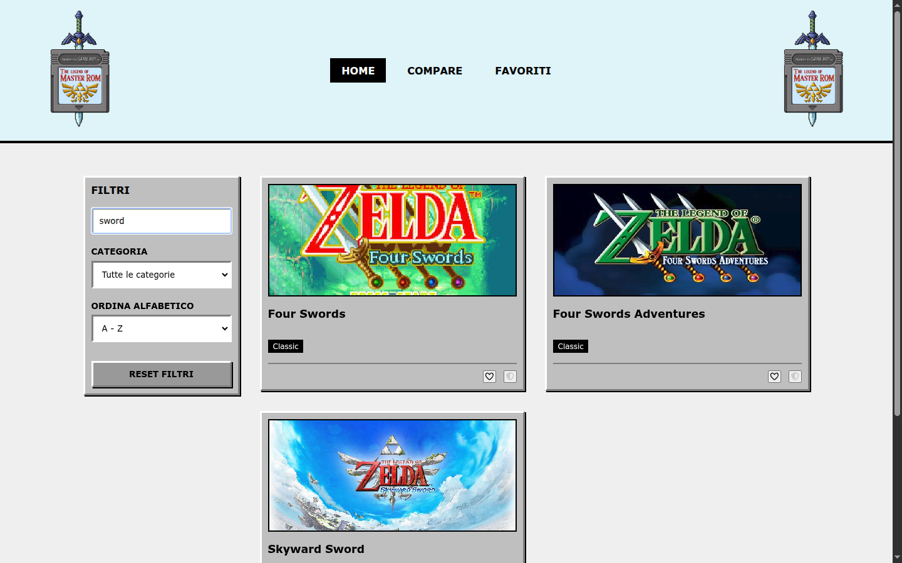
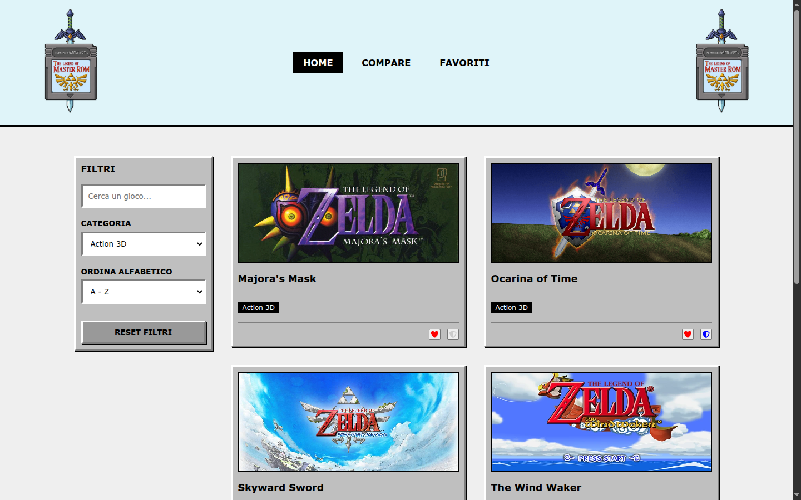
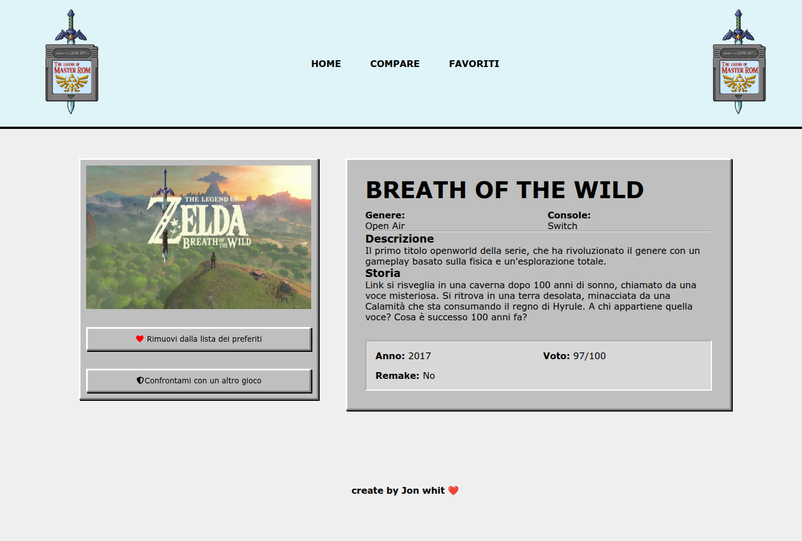
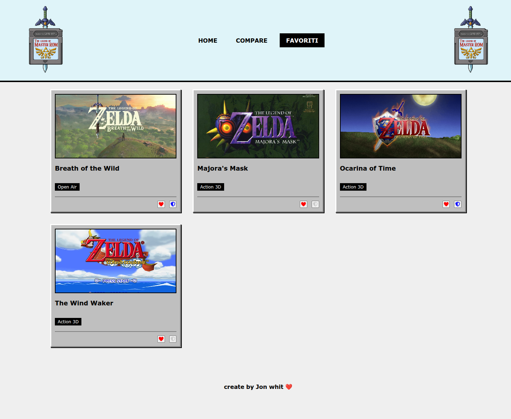
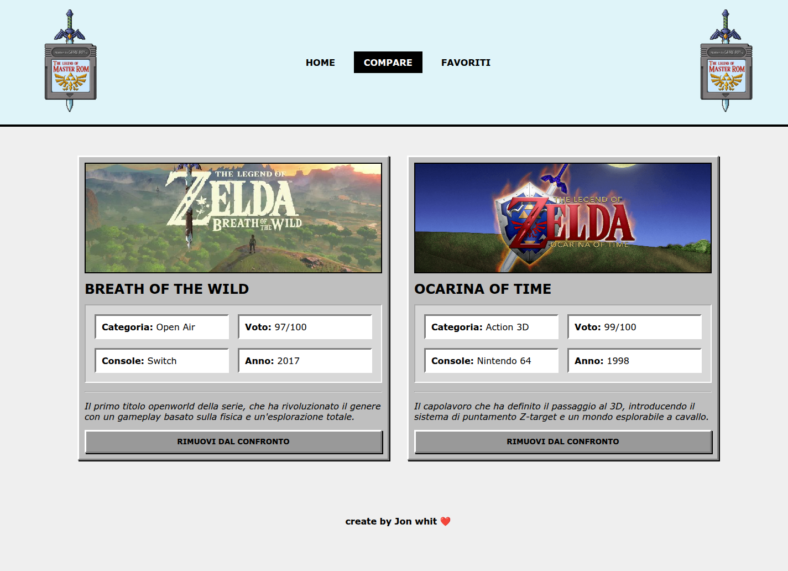

# 🗡️ MasterRom — Zelda Games Explorer 🗡️ 

Single Page Application in **React + Vite** per esplorare i capitoli della saga *The Legend of Zelda*:
ricerca con debounce, filtri per categoria, ordinamento alfabetico, pagina di dettaglio, lista dei
preferiti persistente e confronto fra due giochi.

<br>

| Homepage — lista giochi | Ricerca con debounce |
| :---: | :---: |
|  |  |
| Sidebar filtri + griglia di card, ordinate A→Z | La ricerca aggiorna la lista 500 ms dopo l'ultima digitazione |

| Filtro per categoria | Dettaglio gioco |
| :---: | :---: |
|  |  |
| Filtro `Action 3D` combinato con la ricerca e con l'ordinamento | Scheda completa: descrizione, storia, anno, voto e remake |

### Liste personali

| Preferiti | Confronto |
| :---: | :---: |
|  |  |
| Salvati in `localStorage`, sopravvivono al refresh | Massimo 2 giochi, con dettagli affiancati richiesti all'API |

---

## ✨ Funzionalità

| Funzionalità | Dove | Note |
| --- | --- | --- |
| Lista giochi | `src/components/GameList.jsx` | Dati dall'API, immagini unite lato client |
| Ricerca testuale | `src/components/SearchBar.jsx` | Input controllato + `debounce` custom a 500 ms |
| Filtro per categoria | `src/components/FiltersForm.jsx` | `Classic`, `Side-scrolling`, `Action 3D`, `Open Air` |
| Ordinamento A→Z / Z→A | `src/components/GameList.jsx` | `localeCompare` dentro un `useMemo` |
| Reset filtri | `src/components/FiltersForm.jsx` | Azzera ricerca, categoria e ordinamento |
| Dettaglio gioco | `src/Pages/GameDetails.jsx` | Rotta `/game/:id`, fetch del singolo record |
| Preferiti | `src/context/GlobalContext.jsx` | Persistiti in `localStorage` (chiave `zelda_favorites`) |
| Confronto | `src/Pages/Compare.jsx` | Massimo 2 giochi, dettagli caricati con `Promise.all` |

---

## 🧱 Stack

- **React 19** — componenti funzionali, Context API, `useMemo` / `useCallback` / `memo`
- **React Router 7** — routing con layout condiviso (`<Outlet />`)
- **Vite 8** — dev server e build
- **Font Awesome** — icone cuore (preferiti) e scudo (confronto)
- **CSS vanilla** — stile retro/brutalista (`retro-outset`, `retro-inset`, `brutal-border`)

---

## 🚀 Avvio del progetto

### 1. Installare le dipendenze

```bash
npm install
```

### 2. Avviare il backend

Il frontend consuma un backend REST esterno (non incluso in questo repository). La cartella
`backend/` contiene il materiale da usarci dentro:

- `backend/zeldagame.json` — i 21 giochi della saga
- `backend/types.ts` — il tipo `ZeldaGame` usato dai dati

Una volta avviato, il backend deve esporre la risorsa `zeldagames` (vedi la sezione
[API](#-api)); annota la porta su cui è in ascolto, serve al passo successivo.

### 3. Configurare l'URL dell'API

Crea un file `.env` nella root del progetto (è già in `.gitignore`) e indica l'endpoint della
risorsa, con la porta del tuo backend:

```bash
VITE_API_URL=http://localhost:3333/zeldagames
```

### 4. Avviare il dev server

```bash
npm run dev
```

L'app è disponibile su `http://localhost:5173`.

### Altri comandi

| Comando | Descrizione |
| --- | --- |
| `npm run dev` | Avvia il server di sviluppo con HMR |
| `npm run build` | Genera la build di produzione in `dist/` |
| `npm run preview` | Serve localmente la build di produzione |
| `npm run lint` | Esegue ESLint su tutto il progetto |

---

## 🔌 API

| Metodo | Endpoint | Risposta |
| --- | --- | --- |
| `GET` | `/zeldagames` | Array di giochi |
| `GET` | `/zeldagames/:id` | Oggetto `{ "zeldagame": { ... } }` |

Struttura di un gioco:

```json
{
  "id": 19,
  "title": "Breath of the Wild",
  "category": "Open Air",
  "console": "Switch",
  "platform": "Hybrid",
  "releaseYear": 2017,
  "description": "Il primo titolo openworld della serie...",
  "story": "Link si risveglia in una caverna dopo 100 anni di sonno...",
  "image": "/botw.jpg",
  "vote": 97,
  "remake": false,
  "remakePlatform": ""
}
```

---

## 📁 Struttura del progetto

```
├── backend/
│   ├── types.ts              # tipo ZeldaGame
│   └── zeldagame.json        # dataset dei 21 giochi
├── public/                   # copertine dei giochi + logo
├── src/
│   ├── Pages/
│   │   ├── Homepage.jsx      # filtri + lista
│   │   ├── GameDetails.jsx   # scheda del singolo gioco
│   │   ├── Favorite.jsx      # lista dei preferiti
│   │   └── Compare.jsx       # confronto fra 2 giochi
│   ├── components/
│   │   ├── Header.jsx        # logo + navbar
│   │   ├── Navbar.jsx
│   │   ├── SearchBar.jsx     # input con debounce
│   │   ├── FiltersForm.jsx   # sidebar filtri + reset
│   │   ├── GameList.jsx      # filtro, ordinamento e render delle card
│   │   ├── GameCard.jsx      # card memoizzata
│   │   └── Footer.jsx
│   ├── context/
│   │   └── GlobalContext.jsx # GameContext, FavoriteContext, CompareContext
│   ├── hooks/
│   │   ├── useFetchGames.js  # fetch della lista + merge immagini
│   │   └── useGameDetails.js # fetch del singolo gioco
│   ├── layout/
│   │   └── DefaultLayout.jsx # Header + <Outlet /> + Footer
│   ├── utils/
│   │   ├── debounce.js       # debounce custom
│   │   └── pic.js            # mappa id → immagine in /public
│   ├── App.jsx               # provider + rotte
│   ├── main.jsx
│   └── index.css             # tema retro/brutalista
└── vite.config.js
```

### Rotte

| Rotta | Pagina |
| --- | --- |
| `/` | Homepage con filtri e lista |
| `/game/:id` | Dettaglio del gioco |
| `/compare` | Confronto fra i giochi selezionati |
| `/favorite` | Lista dei preferiti |

---

## 🧠 Scelte tecniche

**Tre Context separati.** `GameContext` (lista + ricerca + filtri), `FavoriteContext` e
`CompareContext` sono provider distinti, così un cambio nei preferiti non fa ri-renderizzare
chi ascolta solo i filtri.

**Ottimizzazioni dei render.** `GameCard` è avvolta in `React.memo`; le funzioni `toggleFav` e
`toggleComp` sono in `useCallback` e i valori dei provider in `useMemo`, per non annullare la
memoizzazione delle card.

**Filtro e ordinamento in `useMemo`.** La catena filtro ricerca → filtro categoria → ordinamento
viene ricalcolata solo quando cambiano i dati, la query o i filtri.

**Debounce sulla ricerca.** L'input resta controllato e reattivo (`inputValue`), mentre
`searchQuery` — che innesca il ricalcolo della lista — viene aggiornato 500 ms dopo l'ultima
digitazione.

**Immagini locali.** Il campo `image` restituito dall'API viene sovrascritto in `useFetchGames`
con la mappa in `src/utils/pic.js`, così le copertine arrivano da `public/` senza toccare il
backend; se un id non è mappato si usa `/placeholder.jpg`.

**Persistenza.** I preferiti vengono scritti in `localStorage` a ogni modifica e riletti al primo
render; il confronto invece è volutamente volatile e si azzera al refresh.